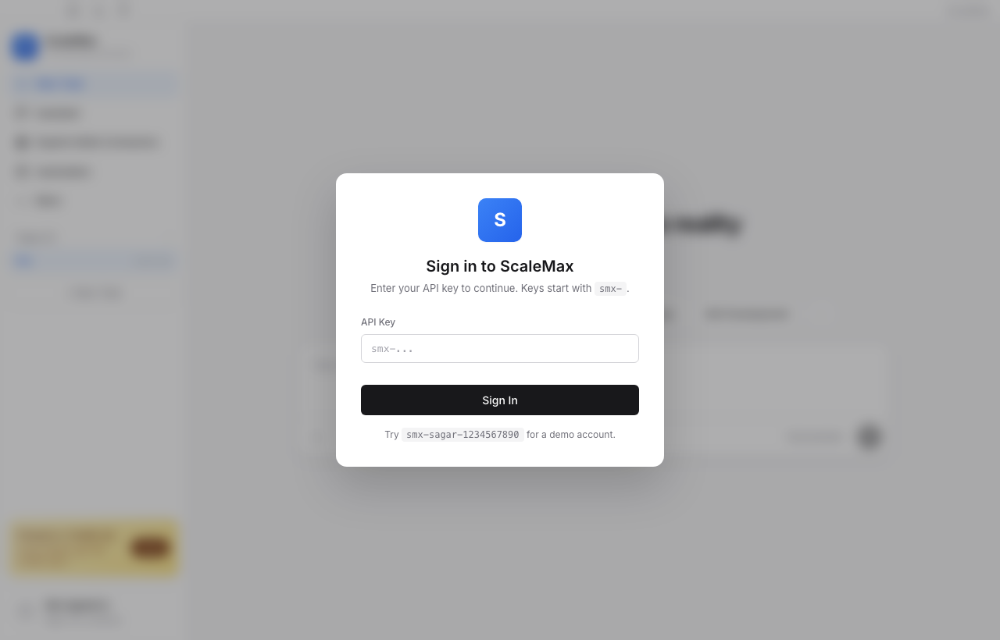
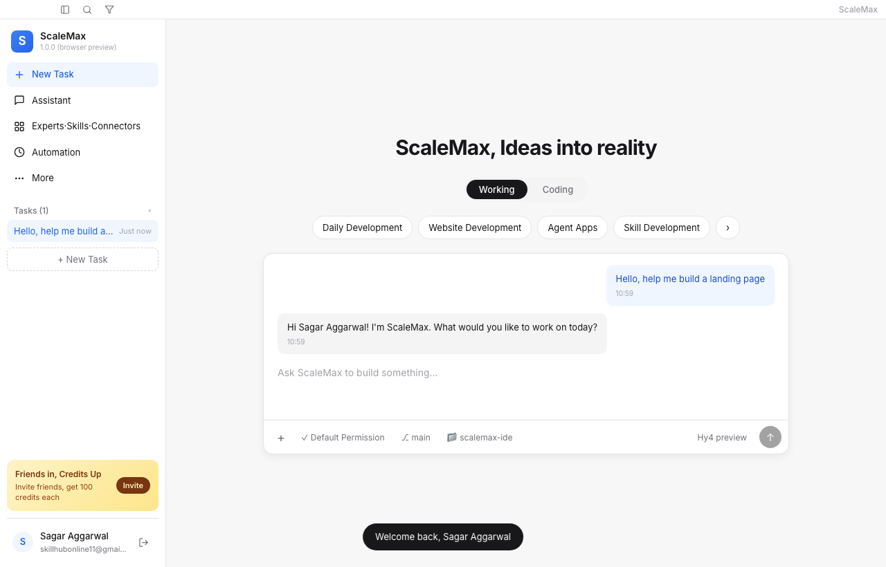
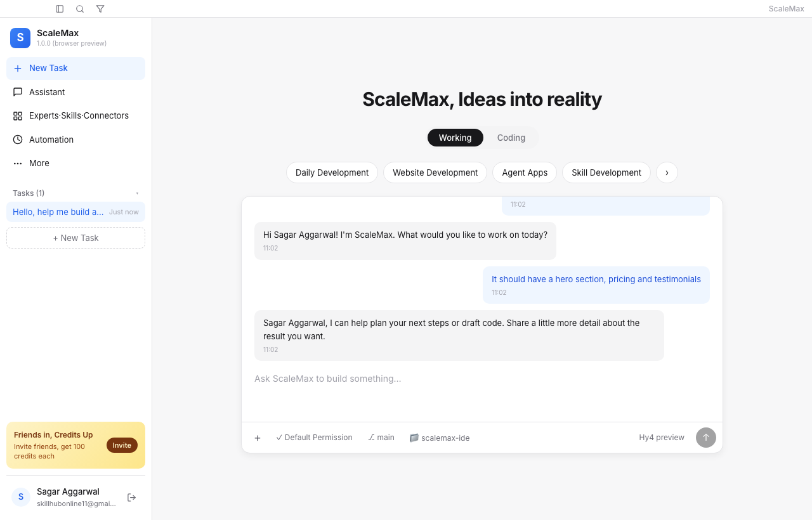
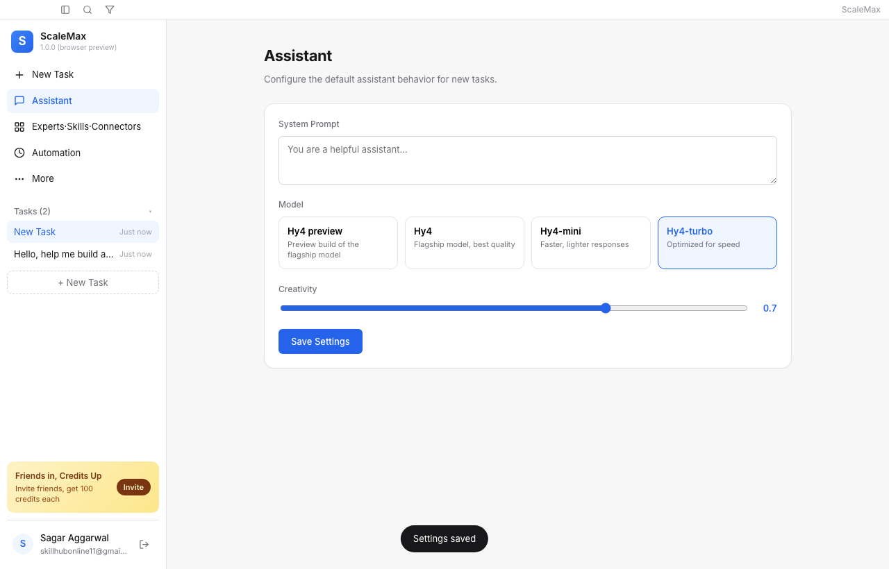
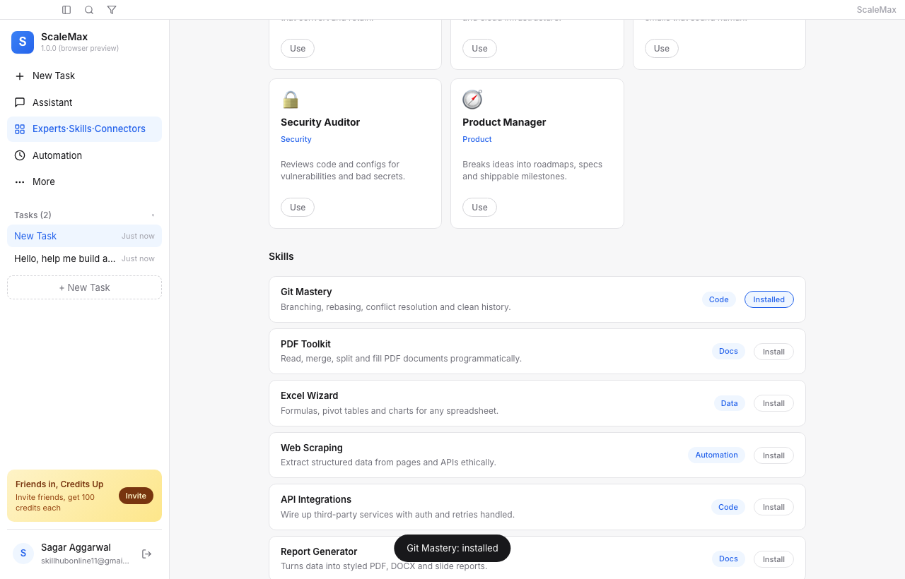
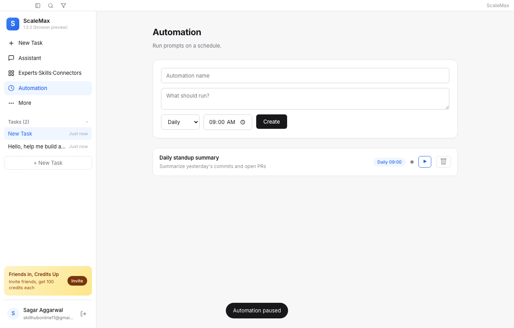

# ScaleMax IDE

ScaleMax IDE is a native macOS desktop IDE for AI-assisted software development. It pairs a chat-first task workspace with a tabbed code workspace, an assistant configurator with MCP tools, an Experts · Skills · Connectors catalog, a scheduled Automation manager, and a macOS-native frameless window. The app is built with Electron; the renderer is plain ES modules with no build step, so `src/` is the source of truth you edit directly.

## Screenshots

| Login | Dashboard | Chat |
| --- | --- | --- |
|  |  |  |

| Assistant | Experts · Skills · Connectors | Automation |
| --- | --- | --- |
|  |  |  |

## Features

- **API-key provider connection** — connect the ScaleMax endpoint (or any OpenAI-compatible endpoint) with an `sm_live_` key; the key is encrypted at rest with `safeStorage` and never crosses the renderer bridge
- **Real chat** — messages go to your configured provider (request/response) and the reply lands in the transcript; every task and message is persisted
- **Works in your folder** — open a folder with the folder button and the model can list, read and search its files, write files and run commands there (reads run on their own in Basic; writes and commands ask first unless you chose Bypass all). Secret files such as `.env` and keys stay off limits
- **MCP tools** — add Model Context Protocol servers (local stdio commands or remote Streamable HTTP endpoints); the model can call their tools during chat and each call is listed under the reply
- **Composer controls** — pick the model next to Send, turn thinking on or off and set reasoning effort; tool permissions: Manual (ask every time), Basic (read-only tools run automatically) or Bypass all (autonomous, after your consent)
- **Image & video** — pick an image or video model in the model menu; its options (size, quality, aspect ratio, resolution, duration, edit, image-to-video) appear above the message box, results show in the chat with Download
- **Several providers** — save more than one provider; the model menu lists all of their models
- **Six views**, one click away in the sidebar:
  - **Chat** — the chat-first workspace with Working/Coding modes and starting-point chips
  - **Workspace** — an IDE layout: file tree with filter and Git decorations, tabbed editor with syntax highlighting, Terminal / Git changes / Diff panel, resizable panes
  - **Assistant** — provider connection, model catalog with per-model toggles, system prompt, temperature, permissions and MCP servers
  - **Experts & resources** — animated expert characters, prompt templates, your own custom experts and skills, community references and 40 connectors (one-click sign-in for 14 of them, otherwise OAuth with your own app or an access token)
  - **Automation** — once, hourly, daily, weekly, monthly or every-N-minutes schedules with run now, pause/resume, edit and run history
  - **Preferences & about** — theme, local data and app information
- **Search across tasks** with an overlay, plus a collapsible sidebar
- **Secure Electron renderer** — `contextIsolation: true`, no node integration; all filesystem and credential access goes through the preload bridge

## Prerequisites

- macOS 11 (Big Sur) or later
- Node.js 18 or later

## Installation

```bash
cd scalemax-ide
npm install
```

## Running

```bash
npm start
```

On macOS this starts a branded copy of the Electron runtime (`node_modules/.scalemax-dev/ScaleMax.app`, created on first run in about a second), so the Dock and the menu bar show ScaleMax and its icon instead of Electron.

### Electron runtime missing after installation

If npm reports `install scripts not yet covered by allowScripts`, it skipped Electron's `postinstall` download. The JavaScript package can exist while its desktop runtime and `path.txt` are missing. Do not delete the dependency tree or disable install-script protection globally.

The reviewed Electron version is already approved in this project's `package.json`. Run the verified repair from the project root in macOS Terminal:

```bash
npm run repair:electron --cache "$PWD/.cache/npm" && npm start --cache "$PWD/.cache/npm"
```

The repair runs Electron's own installer using the same Node runtime as npm. It preserves incomplete `dist` and `path.txt` entries under `.cache/electron-repair-backups/` before retrying into a clean destination. It never deletes `node_modules`, fakes a version file or marker, disables npm approvals, or changes host file protections. Downloads and extraction temporary files remain in `.cache/`. Electron's skip-download and distribution override options are ignored for the repair child only, without modifying your shell configuration.

`npm run check:electron` checks the required runtime files without changing anything. The same check runs automatically before `npm start`; a zero installer exit with missing runtime files is treated as a failure, not success. The check verifies installation files, not the full application UI or production security.

To run the repair with a specific Node 22 runtime, invoke it directly from the project root:

```bash
/path/to/node22/bin/node build/electron-runtime.cjs --repair && npm start --cache "$PWD/.cache/npm"
```

If repair fails, stop and inspect the installer output rather than repeatedly launching the app. File-protection refusals must be resolved in the execution environment; they are not bypassed by this script. Your preserved partial bundle remains in the printed backup path.

Approval is pinned to `electron@33.4.11`. After upgrading, review Electron's new installer and run `npm install-scripts approve electron` with an npm version supporting that command.

Dependency audit warnings are a separate issue. Do not use `npm audit fix --force` blindly: the audit proposes major upgrades to Electron and electron-builder, which need compatibility testing. This prototype is not ready for production distribution without dependency updates and real backend authentication/integrations.

## Browser preview (no Electron needed)

The renderer only talks to Electron through the `window.scalemaxAPI` bridge, so `src/web-shim.js` installs a faithful stand-in when the page is opened outside Electron. That means you can preview and click through the whole app in any browser — no `npm install`, no packaging.

```bash
python3 -m http.server 8765   # from the project root, so the fonts in assets/ load
# then open http://localhost:8765/src/index.html
```

In browser preview, tasks, settings and automations persist to `localStorage` instead of the Electron user-data file. Provider, connector, MCP and workspace features need the desktop app.

> The shim is a **no-op inside Electron** — if `preload.js` has already installed the real bridge, `web-shim.js` does nothing. It is safe to ship.

## Building a distributable

```bash
npm run build
```

The packaged application is written to `dist/`.

## Authentication

ScaleMax is local-first: there is no sign-in screen and no account server. Access to a model provider is what unlocks the composer, and it is configured in the **Assistant** view.

1. Choose **ScaleMax (preconfigured)** and paste an `sm_live_…` key, or choose **Custom OpenAI-compatible endpoint** and enter its base URL plus key.
2. Press **Test connection** — the app verifies the key, discovers the model catalog and shows every model with an availability badge.
3. Enable the models you want and pick one for chat, then **Save provider**.

Keys are encrypted at rest with Electron `safeStorage` when the OS keychain is available and kept only for the session otherwise. The renderer never receives the key — only a `hasKey` flag crosses the bridge. **Clear provider** removes the stored credential and settings.

## Project structure

```
scalemax-ide/
├── assets/               # screenshots, icons, Assistant font files
├── build/                # Electron runtime check + smoke test
├── dist/                 # build output (generated)
├── lib/
│   ├── provider.cjs      # OpenAI-compatible provider client (keys, models, chat, tool calls)
│   ├── connectors.cjs    # encrypted connector credentials, validation, OAuth sessions
│   ├── oauth.cjs         # loopback OAuth 2.0 engine (PKCE, token exchange, refresh)
│   ├── oauth-catalog.cjs # provider OAuth endpoints and rules (main process only)
│   ├── cli-auth.cjs      # GitHub sign-in through the GitHub CLI (downloads gh if missing)
│   ├── mcp.cjs           # MCP client: stdio + Streamable HTTP servers
│   ├── media.cjs         # image/video generation, polling, downloads (main process)
│   ├── mcp-oauth.cjs     # zero-setup MCP sign-in: discovery, dynamic client registration, PKCE
│   ├── mcp-directory.cjs # official MCP servers behind one-click connector sign-in
│   ├── tool-loop.cjs     # chat tool-calling loop over workspace + MCP tools
│   ├── workspace-tools.cjs # built-in chat tools for the open folder
│   ├── state.cjs         # atomic, validated JSON state store
│   └── workspace.cjs     # project folder access: list, read, write, Git, commands
├── src/
│   ├── app.js            # renderer logic: views, tasks, chat, catalogs, automations
│   ├── workspace-ui.js   # Workspace tab: tabs, tree, splitters, highlighting
│   ├── catalog-ui.js     # catalog filters, details, connectors and OAuth dialog
│   ├── custom-ui.js      # create/edit custom experts and skills
│   ├── mcp-ui.js         # MCP server management
│   ├── composer-ui.js    # composer model/reasoning menu, permission modes, tool approval prompts
│   ├── media-ui.js       # image/video generation options, results in chat, download
│   ├── mcp-presets.js    # one-step MCP servers (sign-in, public URL, local)
│   ├── mcp-directory.js  # renderer mirror of the one-click directory (connector ids only)
│   ├── avatars.js        # animated expert characters (SVG)
│   ├── data.js           # experts, skills, community references, connectors
│   ├── index.html        # single-page shell with all six views
│   ├── sm-tokens.css     # design tokens (light + dark themes)
│   ├── styles.css        # component styles built on the tokens
│   ├── workspace.css     # Workspace IDE layout
│   └── web-shim.js       # browser preview stand-in (no-op under Electron)
├── test/                 # node --test unit suites
├── main.js               # Electron main process (project root)
├── preload.js            # exposes window.scalemaxAPI bridge (project root)
├── package.json
└── README.md
```

## Customization

- **Theme** — switch between the light and dark token sets in **Preferences & about**, or edit the custom properties in `src/sm-tokens.css`
- **Accent color** — edit `--sm-brand-primary` in `src/sm-tokens.css`; primary accents, badges and brand marks derive from it
- **Brand name** — update the `ScaleMax` strings in `src/index.html` (title bar, sidebar, headings) and the `productName` field in `package.json`
- **App icon** — edit the SVG sources in `assets/icons/` (`scalemax-icon.svg`, `scalemax-icon-small.svg` for 16/32 px, `scalemax-mark.svg` for the sidebar), run `npm run icons` to re-render `icon.png` and `icon.icns`, then `npm run build`
- **Catalog content** — edit the arrays in `src/data.js` (`skill-catalog.js` and `connector-catalog.js` hold the full libraries)

## License

MIT
